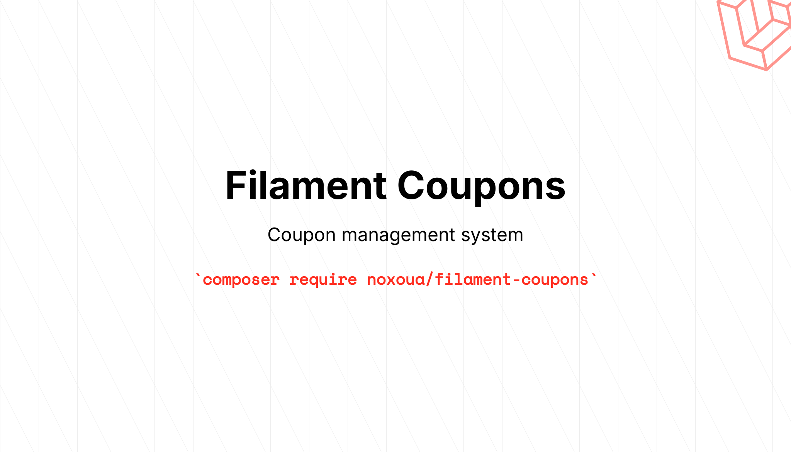

<picture>
    <source media="(prefers-color-scheme: dark)" srcset="art/header-dark.png">
    
</picture>

[](https://packagist.org/packages/noxoua/filament-coupons)
[](https://github.com/noxoua/filament-coupons/actions?query=workflow%3Arun-tests+branch%3Amain)
[](https://github.com/noxoua/filament-coupons/actions?query=workflow%3A"Fix+PHP+code+styling"+branch%3Amain)
[](https://packagist.org/packages/noxoua/filament-coupons)

# Filament Coupons

A powerful and flexible coupon management system for Filament 3.x. This package provides a complete solution for creating, managing, and applying coupons with customizable strategies, usage tracking, and comprehensive validation.

## Features

-   🎫 **Flexible Coupon Management** - Create and manage coupons with codes, expiration dates, and usage limits
-   🎯 **Strategy Pattern** - Implement custom coupon strategies for different discount types
-   📊 **Usage Tracking** - Track coupon usage with polymorphic relationships
-   ⏰ **Time-based Validation** - Support for start and expiration dates
-   🔢 **Usage Limits** - Set maximum usage limits per coupon
-   🎨 **Filament Integration** - Beautiful admin interface with Filament resources
-   🔧 **Extensible** - Easy to extend with custom strategies and validation rules

## Installation

You can install the package via composer:

```bash
composer require noxoua/filament-coupons
```

Then run the installation command:

```bash
php artisan filament-coupons:install
```

## Setup

### Add the Plugin to your Panel

Add the `CouponsPlugin` to your Filament panel:

```php
use Noxo\FilamentCoupons\CouponsPlugin;

public function panel(Panel $panel): Panel
{
    return $panel
        // ...
        ->plugins([
            CouponsPlugin::make(),
        ]);
}
```

## Usage

### Creating Coupon Strategies

The package uses a strategy pattern to handle different types of coupons. You need to create strategies using the provided Artisan command:

```bash
php artisan make:coupons-strategy FreeSubscription
```

This will create a new strategy class in `app/Coupons/FreeSubscriptionStrategy.php`:

```php
class FreeSubscriptionStrategy extends CouponStrategy
{
    public function getLabel(): string
    {
        return 'Free Subscription';
    }

    public function schema(): array
    {
        return [
            Forms\Components\Section::make()
                ->heading($this->getLabel() . ' Details')
                ->compact()
                ->schema([
                    Forms\Components\TextInput::make('months')
                        ->label('Free Months')
                        ->numeric()
                        ->required()
                        ->default(1),
                ]),
        ];
    }

    public function apply(Coupon $coupon): bool
    {
        $user = auth()->user();
        $months = $coupon->payload['months'] ?? 1;

        // Your business logic here
        $user->subscription()->extend($months);

        // Consume the coupon after applying it
        return coupons()->consume($coupon, couponable: $user);
    }
}
```

If you need to reject the coupon during its application, throw a `CouponException` as shown:

```php
use Noxo\FilamentCoupons\Exceptions\CouponException;

public function apply(Coupon $coupon): bool
{
    $user = auth()->user();
    $months = $coupon->payload['months'] ?? 1;

    if ($user->isAdmin()) {
        throw new CouponException('This coupon is not applicable for you!');
    }

    // Your business logic here
    $user->subscription()->extend($months);

    // Consume the coupon after applying it
    return coupons()->consume($coupon, couponable: $user);
}
```

### Registering Strategies

After creating a strategy, register it in the config file:

```php
// config/filament-coupons.php
return [
    'strategies' => [
        \App\Coupons\FreeSubscriptionStrategy::class,
        // Add more strategies here
    ],
];
```

### Using Filament Action

The package includes a pre-built Filament Action that handles coupon application. The action automatically performs all necessary validations and gracefully handles `CouponException` errors. You can use this standard Filament action anywhere in your application.

```php
use Noxo\FilamentCoupons\Actions\ApplyCouponAction;

ApplyCouponAction::make(),
```

### Using the Coupons Service

The package provides a convenient service for working with coupons:

```php
use Noxo\FilamentCoupons\Models\Coupon;

$coupon = Coupon::where('code', 'WELCOME2012')->first();

// Check if a coupon is valid
if (coupons()->isValid($coupon)) {
    // Apply the coupon
    coupons()->applyCoupon($coupon);
}

// Check specific conditions
if (coupons()->isActive($coupon)) {
    // Coupon is active and within date range
}

if (coupons()->canConsume($coupon)) {
    // Coupon hasn't reached usage limit
}

// Manually consume a coupon
coupons()->consume(
    coupon: $coupon,
    couponable: auth()->user(),
    meta: ['order_id' => 123]
);
```

## Testing

**TODO: add tests**

```bash
composer test
```

## Changelog

Please see [CHANGELOG](CHANGELOG.md) for more information on what has changed recently.

## Contributing

Please see [CONTRIBUTING](.github/CONTRIBUTING.md) for details.

## Security Vulnerabilities

Please review [our security policy](../../security/policy) on how to report security vulnerabilities.

## Credits

-   [Noxo](https://github.com/noxoua)
-   [All Contributors](../../contributors)

## License

The MIT License (MIT). Please see [License File](LICENSE.md) for more information.
