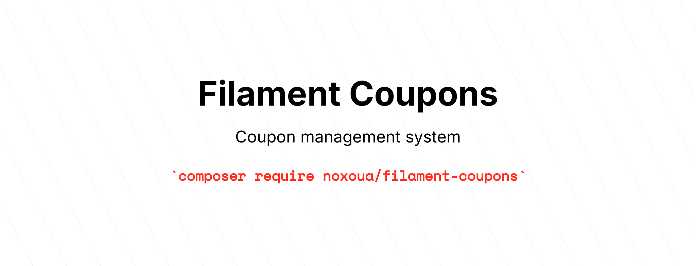

<picture>
    <source media="(prefers-color-scheme: dark)" srcset="art/header-dark.png">
    
</picture>

[](https://packagist.org/packages/noxoua/filament-coupons)
[](https://github.com/noxoua/filament-coupons/actions?query=workflow%3Arun-tests+branch%3Amain)
[](https://github.com/noxoua/filament-coupons/actions?query=workflow%3A"Fix+PHP+code+styling"+branch%3Amain)
[](https://packagist.org/packages/noxoua/filament-coupons)

# Filament Coupons

A flexible coupon management system for Filament 3.x with customizable strategies and usage tracking.

## Installation

```bash
composer require noxoua/filament-coupons

php artisan filament-coupons:install
```

## Setup

Add the plugin to your Filament panel:

```php
use Noxo\FilamentCoupons\CouponsPlugin;

public function panel(Panel $panel): Panel
{
    return $panel
        ->plugins([
            CouponsPlugin::make(),
        ]);
}
```

## Usage

### Creating Strategies

Create custom coupon strategies:

```bash
php artisan make:coupons-strategy FreeSubscription
```

Register in config:

```php
// config/filament-coupons.php
'strategies' => [
    \App\Coupons\FreeSubscriptionStrategy::class,
],
```

### Strategy Example

```php
class FreeSubscriptionStrategy extends CouponStrategy
{
    public function schema(): array
    {
        return [
            Forms\Components\TextInput::make('days')
                ->label('Days')
                ->numeric()
                ->required(),
        ];
    }

    public function apply(Coupon $coupon): bool
    {
        $user = auth()->user();
        $days = $coupon->payload['days'] ?? 7;

        // Your business logic
        $user->extendSubscription($days);

        // Configure notifications and redirects
        $this->successNotification(
            fn ($notification) => $notification
                ->title('Coupon Applied!')
                ->body("You got {$days} free days")
        );

        $this->successRedirectUrl('/dashboard');

        // Consume coupon
        return coupons()->consume($coupon, couponable: $user);
    }
}
```

**Available methods for strategies:**

-   Custom notifications
    -   `successNotification`
    -   `failureNotification`
-   Custom redirects
    -   `successRedirectUrl`
    -   `failureRedirectUrl`

### Using the Action

The package provides a ready-to-use `ApplyCouponAction` that can be integrated anywhere in your Filament application:

**In Livewire Components:**

```php
use Noxo\FilamentCoupons\Actions\ApplyCouponAction;

class Dashboard extends Component implements HasActions
{
    use InteractsWithActions;

    public function applyCouponAction(): Action
    {
        return ApplyCouponAction::make()
            ->button()
            ->label('Apply Coupon');
    }

    public function render()
    {
        return view('dashboard');
    }
}
```

```blade
{{-- dashboard.blade.php --}}
<div>
    <h2>Dashboard</h2>
    {{ $this->applyCouponAction }}
</div>
```

**In Resource Pages:**

```php
use Noxo\FilamentCoupons\Actions\ApplyCouponAction;

class ListPosts extends ListRecords
{
    protected function getHeaderActions(): array
    {
        return [
            Actions\CreateAction::make(),
            ApplyCouponAction::make(),
        ];
    }
}
```

**In Custom Pages:**

```php
use Noxo\FilamentCoupons\Actions\ApplyCouponAction;

class SettingsPage extends Page
{
    protected function getHeaderActions(): array
    {
        return [
            ApplyCouponAction::make()
                ->label('Redeem Coupon')
                ->color('success'),
        ];
    }
}
```

### Manual Using

```php
$coupon = Coupon::where('code', 'WELCOME2012')->first();

// Validate
if (coupons()->isValid($coupon)) {
    // Apply
    coupons()->applyCoupon($coupon);
}
```

## Testing

**TODO: add tests**

```bash
# composer test
```

## Credits

-   [Noxo](https://github.com/noxoua)
-   [All Contributors](../../contributors)

## License

The MIT License (MIT). Please see [License File](LICENSE.md) for more information.
